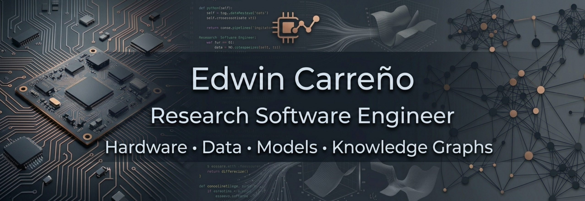

<div align="center">



</div>

---

## Engineering trajectory

```text
Electronics Engineering ─────► Computer Science ─────► Research Software Engineering
        circuits                       systems                    scientific impact
        embedded                       data workflows             reproducible research
        digital design                 AI + modelling             computational biomedicine
```

I started close to hardware as an **Electronics Engineer** and later moved deeper into **Computer Science**, software architecture, scientific computing, AI, and research software infrastructure.

Today, I build reliable software systems for **computational biomedicine**, **knowledge graphs**, **data-intensive research workflows**, and **climate-driven disease modelling**.

---

## Value proposition

- I design and maintain **production-grade scientific software** that remains understandable, testable, and reproducible over time.
- I connect **hardware-aware systems thinking** with modern software architecture to deliver robust research and engineering platforms.
- I build **biomedical and knowledge graph infrastructure** that turns heterogeneous data into reusable, decision-ready assets.
- I deliver applied **deep learning and mathematical optimization** workflows for research and data-intensive engineering problems.
- I prioritize **engineering discipline** (testing, CI/CD, documentation, clear interfaces) to support long-term team ownership.
- I work at the intersection of **software engineering, data engineering, and research delivery**, helping teams move from prototypes to reliable systems.

---

## What I build

<table>
<tr>
<td width="50%">

### Scientific software

- Reproducible research workflows  
- Tested and documented scientific code  
- Model execution and validation pipelines  
- NetCDF, xarray, SciPy, Dask workflows  

</td>
<td width="50%">

### Biomedical data systems

- Knowledge graph tooling  
- Ontology-based data integration  
- BioCypher ecosystem components  
- Reusable research infrastructure  

</td>
</tr>
<tr>
<td width="50%">

### Software architecture

- Maintainable Python systems  
- APIs and backend services  
- CI/CD, testing, documentation  
- Long-term research code ownership  

</td>
<td width="50%">

### Hardware-aware engineering

- Embedded systems background  
- Digital design foundations  
- Low-level programming mindset  
- System-level reliability thinking  

</td>
</tr>
</table>

---

## Technical stack

| Area                  | Core technologies                          |
| --------------------- | ------------------------------------------ |
| Languages             | Python, C, C++, Bash                       |
| Scientific computing  | NumPy, SciPy, pandas, xarray, Dask, NetCDF |
| Backend and data      | FastAPI, PostgreSQL                        |
| Platform and delivery | Linux, Docker, GitHub Actions              |

---

## Current focus

| Focus area                       | Active direction                                                        |
| -------------------------------- | ----------------------------------------------------------------------- |
| Research software engineering    | Reproducible workflows, testing, and maintainable architecture          |
| Deep learning and optimization   | ML engineering pipelines with rigorous model development and validation |
| Scientific Python                | Data-intensive pipelines with xarray, Dask, and NetCDF                  |
| Computational biomedicine        | Knowledge-graph-centered data integration and analysis                  |
| Climate-driven disease modelling | Robust modelling workflows and validation pipelines                     |
| AI-assisted software engineering | Practical automation for development and research tooling               |


---

## Engineering principles

```text
Reliable      → tested, documented, maintainable
Reproducible  → clear inputs, outputs, environments, and assumptions
Readable      → clean interfaces, explicit design, understandable workflows
Collaborative → built for teams, review, reuse, and long-term ownership
Useful        → designed for real scientific and engineering problems
```

---

## Collaboration

I am interested in collaborations around:

```text
Research Software Engineering · Scientific Computing · Computational Biomedicine
Knowledge Graphs · Reproducible Workflows · AI-assisted Development
Embedded Systems · Hardware-Aware Software · Software Architecture
```

---

## How to reach me

Open to:
- Research software engineering roles
- Senior backend/platform engineering for scientific or data-intensive products
- Deep learning and ML engineering roles with strong scientific or biomedical components
- Collaborations in computational biomedicine, knowledge graphs, and reproducible scientific workflows

| Channel                                                      | Best for                                                            |
| ------------------------------------------------------------ | ------------------------------------------------------------------- |
| [LinkedIn](https://www.linkedin.com/in/edwin-carreno-lozano) | Recruiter outreach, role discussions, and professional networking   |
| [ORCID](https://orcid.org/0009-0005-3359-2211)               | Research identity, publications, and academic collaboration context |
| [GitHub](https://github.com/ecarrenolozano)                  | Code, projects, and technical background review                     |
| edwin.carreno@iwr.uni-heidelberg.de                          | Research and institutional communication                            |
| edwin1892@gmail.com                                          | Direct contact for collaborations and opportunities                 |
